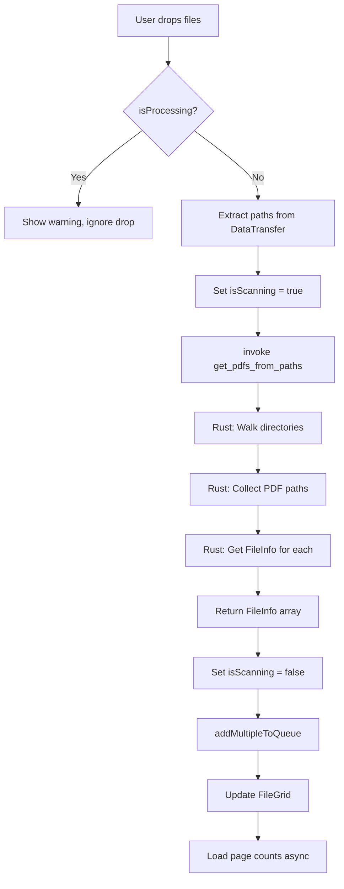

# Drag and Drop PDF File Upload - Design Document

**Feature**: Drag and drop mechanism for PDF files and folders in OCR Module
**Date**: 2025-11-06
**Status**: Design Phase

---

## Table of Contents

1. [Overview](#overview)
2. [Requirements](#requirements)
3. [Current Architecture Analysis](#current-architecture-analysis)
4. [Design Specification](#design-specification)
5. [Implementation Plan](#implementation-plan)
6. [UI/UX Design](#uiux-design)
7. [Technical Details](#technical-details)
8. [Testing Plan](#testing-plan)
9. [Future Enhancements](#future-enhancements)

---

## Overview

### Purpose
Enable users to drag and drop PDF files and folders directly into the OCR Module's center panel, providing a more intuitive file selection method alongside the existing "Add Files" button.

### Key Features
- **Drag and drop PDF files** directly into the center panel
- **Drag and drop folders** with recursive PDF discovery
- **Visual feedback** during drag operations (hover states, drop zones)
- **Processing state awareness** - only accept drops when no OCR is running
- **Bulk folder processing** - automatically find all PDFs in dropped folders and subfolders

### User Story
> As a user, I want to drag PDF files or folders containing PDFs from my file explorer directly into the OCR Module, so I can quickly add multiple files to the queue without navigating through file selection dialogs.

---

## Requirements

### Functional Requirements

1. **FR-1**: Accept PDF files dropped into the center panel
   - Must validate file extensions (.pdf)
   - Must extract file metadata (name, size, page count)
   - Must add valid PDFs to the OCR queue

2. **FR-2**: Accept folders dropped into the center panel
   - Must recursively search all subfolders for PDF files
   - Must ignore non-PDF files
   - Must handle deeply nested folder structures

3. **FR-3**: Prevent drops during active processing
   - Must check `isProcessing` state before accepting drops
   - Must provide visual feedback that drops are disabled
   - Must show clear message explaining why drops are disabled

4. **FR-4**: Provide visual feedback during drag operations
   - Must highlight drop zone when files are dragged over
   - Must show different states: idle, drag-over, processing, disabled
   - Must provide clear messaging for each state

5. **FR-5**: Handle mixed file and folder drops
   - Must accept drag events with both files and folders
   - Must process all items in a single drop event

### Non-Functional Requirements

1. **NFR-1**: Performance
   - Must handle folders with 100+ PDFs efficiently
   - Must show progress feedback for large folder scans
   - Should use async operations to prevent UI blocking

2. **NFR-2**: Usability
   - Must integrate seamlessly with existing "Add Files" button
   - Must provide clear error messages for invalid drops
   - Should match existing UI theme and design patterns

3. **NFR-3**: Compatibility
   - Must work on Windows, macOS, and Linux
   - Must handle different file system path formats
   - Must respect Tauri's security constraints

---

## Current Architecture Analysis

### Existing Components

#### OCRModule.svelte (Lines 462-482)
```svelte
<!-- Center Panel (50%) - Hero Section -->
<div class="w-[50%] border-r border-gray-300 dark:border-gray-700 p-4 flex flex-col">
  <!-- Remove Button (conditional) -->
  {#if hasSelection}
    <div class="mb-4">
      <Button variant="danger" size="sm" on:click={handleRemoveSelected}>
        Remove Selected ({selectedFileIds.length})
      </Button>
    </div>
  {/if}

  <!-- File Grid -->
  <div class="flex-1 overflow-auto">
    <FileGrid bind:selectedIds={selectedFileIds} />
  </div>
</div>
```

**Current Behavior**:
- 50% width center panel
- Shows FileGrid component (from ocrQueue store)
- "Remove Selected" button when files are selected
- Overflow auto for scrolling

### State Management

#### Processing State
```typescript
// OCRModule.svelte
let isProcessing = false;  // Line 42
$: canStartOCR = $ocrQueue.length > 0 && !isProcessing && $destinationFolder.length > 0;  // Line 51
```

#### Queue Management (ocrQueue.ts)
```typescript
// Add multiple files
export function addMultipleToQueue(files: Omit<OCRQueueItem, 'id' | 'status'>[]): void {
  const newItems: OCRQueueItem[] = files.map(file => ({
    ...file,
    id: crypto.randomUUID(),
    status: 'pending',
    progress: 0
  }));

  ocrQueue.update(queue => [...queue, ...newItems]);
}
```

### Existing Tauri Commands (commands.rs)

1. **select_multiple_pdf_files** (Line 69-84)
   - Opens file dialog for multiple PDFs
   - Returns `Vec<String>` of file paths

2. **get_file_info** (Line 100-125)
   - Takes file path
   - Returns FileInfo with metadata

3. **start_batch_ocr** (Line 275-366)
   - Checks `state.status.is_running` (Line 310)
   - Returns error if already processing (Line 311)

### File Selection Flow

**Current Flow**:
```
User clicks "Add Files"
  → invoke("select_multiple_pdf_files")
  → User selects files in dialog
  → Returns file paths
  → For each file: invoke("get_file_info")
  → addMultipleToQueue(fileInfos)
  → FileGrid updates
```

**Proposed Drag & Drop Flow**:
```
User drags files/folders over panel
  → dragenter event → Show drop zone
  → dragover event → Maintain drop zone
  → drop event → Extract paths
  → Distinguish files vs folders
  → invoke("get_pdfs_from_paths", { paths })
  → Returns list of FileInfo objects
  → addMultipleToQueue(fileInfos)
  → FileGrid updates
  → dragleave event → Hide drop zone
```

---

## Design Specification

### Component Architecture

```
OCRModule.svelte
├── Center Panel (Drop Zone Container)
│   ├── Drop Zone Overlay (conditionally shown)
│   │   ├── Icon/Visual indicator
│   │   ├── Message text
│   │   └── State-based styling
│   └── FileGrid (existing)
└── Event Handlers
    ├── on:dragenter
    ├── on:dragover
    ├── on:dragleave
    └── on:drop
```

### State Variables

```typescript
// New state variables in OCRModule.svelte
let isDragging = false;           // True when files are being dragged over
let dropZoneActive = false;       // True when drop zone should highlight
let isScanning = false;           // True during folder scan operations
```

### Drop Zone States

| State | Condition | Visual | Message |
|-------|-----------|--------|---------|
| **Empty** | `$ocrQueue.length === 0 && !isProcessing` | Dashed border, gray background | "Drag and drop PDF files or folders here, or click 'Add Files'" |
| **Idle** | `$ocrQueue.length > 0 && !isProcessing && !isDragging` | Normal FileGrid display | - |
| **Drag Over** | `isDragging && !isProcessing` | Blue border, light blue background | "Drop PDF files or folders here" |
| **Processing** | `isProcessing` | Dimmed, disabled cursor | "Processing... Cannot accept files during OCR" |
| **Scanning** | `isScanning` | Blue border, scanning indicator | "Scanning folder for PDFs..." |

---

## Implementation Plan

### Phase 1: Frontend - Drop Zone UI

**File**: `src/lib/components/OCRModule.svelte`

#### 1.1 Add State Variables
```typescript
// After line 42 (existing state)
let isDragging = false;
let dropZoneActive = false;
let isScanning = false;
```

#### 1.2 Add Event Handlers
```typescript
/**
 * Handle drag enter - show drop zone
 */
function handleDragEnter(e: DragEvent) {
  if (isProcessing) return;  // Ignore if processing

  e.preventDefault();
  e.stopPropagation();
  isDragging = true;
  dropZoneActive = true;
}

/**
 * Handle drag over - maintain drop zone
 */
function handleDragOver(e: DragEvent) {
  if (isProcessing) return;

  e.preventDefault();
  e.stopPropagation();
  e.dataTransfer!.dropEffect = 'copy';
}

/**
 * Handle drag leave - hide drop zone
 */
function handleDragLeave(e: DragEvent) {
  e.preventDefault();
  e.stopPropagation();

  // Check if we're leaving the drop zone container
  const rect = (e.currentTarget as HTMLElement).getBoundingClientRect();
  const x = e.clientX;
  const y = e.clientY;

  if (x < rect.left || x >= rect.right || y < rect.top || y >= rect.bottom) {
    isDragging = false;
    dropZoneActive = false;
  }
}

/**
 * Handle file/folder drop
 */
async function handleDrop(e: DragEvent) {
  e.preventDefault();
  e.stopPropagation();

  isDragging = false;
  dropZoneActive = false;

  if (isProcessing) {
    addLog('WARNING: Cannot add files during processing', 'info');
    return;
  }

  try {
    // Extract file paths from DataTransfer
    const items = Array.from(e.dataTransfer?.items || []);
    const paths: string[] = [];

    // Get file paths (Tauri provides native paths)
    for (const item of items) {
      if (item.kind === 'file') {
        const file = item.getAsFile();
        if (file && (file as any).path) {
          paths.push((file as any).path);
        }
      }
    }

    if (paths.length === 0) {
      addLog('WARNING: No valid files or folders detected', 'info');
      return;
    }

    addLog(`Processing ${paths.length} dropped item(s)...`, 'info');
    isScanning = true;

    // Call new Tauri command to process paths
    const fileInfos = await invoke<FileInfo[]>("get_pdfs_from_paths", { paths });

    isScanning = false;

    if (fileInfos.length === 0) {
      addLog('WARNING: No PDF files found in dropped items', 'info');
      return;
    }

    // Add to queue
    addMultipleToQueue(
      fileInfos.map((info) => ({
        fileName: info.name,
        filePath: info.path,
        pages: info.page_count || 0,
        size: info.size,
      }))
    );

    addLog(`✓ Added ${fileInfos.length} PDF file(s) to queue`, 'success');

    // Load page counts asynchronously
    loadPageCounts();

  } catch (error) {
    console.error("Failed to process dropped files:", error);
    addLog(`ERROR: Failed to process dropped files: ${error}`, 'error');
    isScanning = false;
  }
}
```

#### 1.3 Update Center Panel Markup
```svelte
<!-- Center Panel (50%) - Drop Zone Container -->
<div
  class="w-[50%] border-r border-gray-300 dark:border-gray-700 p-4 flex flex-col relative"
  class:drop-zone-active={dropZoneActive && !isProcessing}
  class:drop-zone-disabled={isProcessing}
  on:dragenter={handleDragEnter}
  on:dragover={handleDragOver}
  on:dragleave={handleDragLeave}
  on:drop={handleDrop}
>
  <!-- Drop Zone Overlay -->
  {#if dropZoneActive && !isProcessing}
    <div class="absolute inset-0 z-10 pointer-events-none flex items-center justify-center bg-blue-50/90 dark:bg-blue-900/30 border-4 border-dashed border-blue-400 dark:border-blue-500 rounded-lg">
      <div class="text-center">
        <div class="text-6xl mb-4">📄</div>
        <div class="text-xl font-semibold text-blue-700 dark:text-blue-300">
          Drop PDF files or folders here
        </div>
      </div>
    </div>
  {/if}

  {#if isScanning}
    <div class="absolute inset-0 z-10 pointer-events-none flex items-center justify-center bg-blue-50/90 dark:bg-blue-900/30 border-4 border-dashed border-blue-400 dark:border-blue-500 rounded-lg">
      <div class="text-center">
        <div class="text-6xl mb-4 animate-pulse">🔍</div>
        <div class="text-xl font-semibold text-blue-700 dark:text-blue-300">
          Scanning folder for PDFs...
        </div>
      </div>
    </div>
  {/if}

  <!-- Empty State with Drop Hint -->
  {#if $ocrQueue.length === 0 && !isProcessing}
    <div class="flex-1 flex items-center justify-center border-2 border-dashed border-gray-400 dark:border-gray-600 rounded-lg">
      <div class="text-center text-gray-500 dark:text-gray-400 p-8">
        <div class="text-6xl mb-4">📁</div>
        <div class="text-lg font-medium mb-2">No files in queue</div>
        <div class="text-sm">Drag and drop PDF files or folders here</div>
        <div class="text-sm">or click "Add Files" to browse</div>
      </div>
    </div>
  {:else}
    <!-- Remove Button (conditional) -->
    {#if hasSelection}
      <div class="mb-4">
        <Button
          variant="danger"
          size="sm"
          on:click={handleRemoveSelected}
          disabled={isProcessing}
        >
          Remove Selected ({selectedFileIds.length})
        </Button>
      </div>
    {/if}

    <!-- File Grid -->
    <div class="flex-1 overflow-auto">
      <FileGrid bind:selectedIds={selectedFileIds} />
    </div>
  {/if}
</div>

<style>
  .drop-zone-active {
    transition: all 0.2s ease;
  }

  .drop-zone-disabled {
    opacity: 0.6;
    cursor: not-allowed;
  }
</style>
```

---

### Phase 2: Backend - Tauri Command

**File**: `src-tauri/src/commands.rs`

#### 2.1 Add New Command

```rust
use std::fs;
use walkdir::WalkDir;  // Add to Cargo.toml: walkdir = "2"

/// Processes a list of file and folder paths, returning all PDF files found
/// Recursively searches folders for PDFs
#[tauri::command]
pub async fn get_pdfs_from_paths(
    paths: Vec<String>,
    app: tauri::AppHandle,
    state: State<'_, AppState>,
) -> Result<Vec<FileInfo>, String> {
    let mut pdf_files: Vec<FileInfo> = Vec::new();

    for path_str in paths {
        let path = PathBuf::from(&path_str);

        if !path.exists() {
            eprintln!("Warning: Path does not exist: {}", path_str);
            continue;
        }

        if path.is_file() {
            // Check if it's a PDF
            if path_str.to_lowercase().ends_with(".pdf") {
                match get_file_info(path_str, app.clone(), state.clone()).await {
                    Ok(file_info) => pdf_files.push(file_info),
                    Err(e) => eprintln!("Warning: Failed to get info for {}: {}", path_str, e),
                }
            }
        } else if path.is_dir() {
            // Recursively search directory for PDFs
            for entry in WalkDir::new(&path)
                .follow_links(true)
                .into_iter()
                .filter_map(|e| e.ok())
            {
                let entry_path = entry.path();

                if entry_path.is_file() {
                    let entry_str = entry_path.to_string_lossy().to_string();
                    if entry_str.to_lowercase().ends_with(".pdf") {
                        match get_file_info(entry_str, app.clone(), state.clone()).await {
                            Ok(file_info) => pdf_files.push(file_info),
                            Err(e) => eprintln!("Warning: Failed to get info for {:?}: {}", entry_path, e),
                        }
                    }
                }
            }
        }
    }

    Ok(pdf_files)
}
```

#### 2.2 Register Command

**File**: `src-tauri/src/main.rs`

```rust
.invoke_handler(tauri::generate_handler![
    select_pdf_file,
    select_multiple_pdf_files,
    select_folder,
    get_file_info,
    get_pdf_page_count,
    get_pdfs_from_paths,  // ADD THIS LINE
    start_processing,
    start_batch_ocr,
    cancel_processing,
    cancel_batch_ocr,
    get_processing_status,
    quit_app
])
```

#### 2.3 Update Cargo.toml

**File**: `src-tauri/Cargo.toml`

```toml
[dependencies]
# ... existing dependencies ...
walkdir = "2"  # ADD THIS
```

---

### Phase 3: Type Definitions

**File**: `src/lib/types/index.ts`

No changes needed - FileInfo interface already exists:

```typescript
export interface FileInfo {
  path: string;
  name: string;
  size: number;
  page_count?: number;
}
```

---

## UI/UX Design

### Visual States

#### 1. Empty State (No Files)
```
┌─────────────────────────────────────────┐
│                                         │
│              📁                         │
│        No files in queue                │
│                                         │
│   Drag and drop PDF files or folders    │
│       or click "Add Files" to browse    │
│                                         │
└─────────────────────────────────────────┘
```

#### 2. Drag Over State
```
╔═════════════════════════════════════════╗
║  [Light blue background with opacity]   ║
║                                         ║
║              📄                         ║
║    Drop PDF files or folders here       ║
║                                         ║
╚═════════════════════════════════════════╝
```

#### 3. Scanning Folders State
```
╔═════════════════════════════════════════╗
║  [Light blue background with opacity]   ║
║                                         ║
║              🔍 (pulsing)               ║
║      Scanning folder for PDFs...        ║
║                                         ║
╚═════════════════════════════════════════╝
```

#### 4. Processing Disabled State
```
┌─────────────────────────────────────────┐
│  [Dimmed/grayed out with 60% opacity]   │
│                                         │
│        [FileGrid shown dimmed]          │
│                                         │
│   Processing... Cannot accept files     │
│                                         │
└─────────────────────────────────────────┘
```

### Color Scheme (matching existing theme)

**Light Theme**:
- Drop zone background: `bg-blue-50/90` (light blue, 90% opacity)
- Drop zone border: `border-blue-400` (medium blue, dashed)
- Text: `text-blue-700` (dark blue)

**Dark Theme**:
- Drop zone background: `bg-blue-900/30` (dark blue, 30% opacity)
- Drop zone border: `border-blue-500` (bright blue, dashed)
- Text: `text-blue-300` (light blue)

### Animations

1. **Drop zone fade in/out**: 200ms ease transition
2. **Scanning icon pulse**: Tailwind's `animate-pulse`
3. **Border highlight**: Smooth color transition on drag enter

---

## Technical Details

### Drag and Drop API

#### DataTransfer Object
Tauri provides native file paths via the `DataTransfer` API:

```typescript
const file = item.getAsFile();
const nativePath = (file as any).path;  // Tauri-specific
```

**Important**: Standard web `File` objects don't have direct paths for security reasons, but Tauri extends this to provide native file system paths.

### File System Traversal

#### walkdir Crate
- **Performance**: Efficient directory walking with minimal allocations
- **Features**:
  - Recursive traversal
  - Symlink following (configurable)
  - Error handling per entry
  - Cross-platform (Windows, macOS, Linux)

#### Path Handling
```rust
// Windows: C:\Users\...\file.pdf
// macOS:   /Users/.../file.pdf
// Linux:   /home/.../file.pdf

// All handled transparently by PathBuf
```

### Error Handling

#### Frontend Errors
```typescript
try {
  const fileInfos = await invoke<FileInfo[]>("get_pdfs_from_paths", { paths });
} catch (error) {
  addLog(`ERROR: Failed to process dropped files: ${error}`, 'error');
}
```

#### Backend Errors
```rust
// Non-fatal: Log warning and continue
eprintln!("Warning: Failed to get info for {}: {}", path_str, e);

// Fatal: Return error to frontend
Err(format!("Critical error: {}", e))
```

### State Management Flow



---

## Testing Plan

### Unit Tests

#### Frontend (Svelte Component Tests)

**Test File**: `src/lib/components/__tests__/OCRModule.test.ts`

```typescript
describe('OCRModule Drag and Drop', () => {
  test('should show drop zone on drag enter', () => {
    // Simulate dragenter event
    // Assert drop zone overlay is visible
  });

  test('should hide drop zone on drag leave', () => {
    // Simulate dragleave event
    // Assert drop zone overlay is hidden
  });

  test('should ignore drop when processing', () => {
    // Set isProcessing = true
    // Simulate drop event
    // Assert no files added to queue
  });

  test('should call get_pdfs_from_paths on drop', async () => {
    // Mock invoke function
    // Simulate drop event with file paths
    // Assert invoke called with correct paths
  });
});
```

#### Backend (Rust Tests)

**Test File**: `src-tauri/src/commands.rs`

```rust
#[cfg(test)]
mod tests {
    use super::*;

    #[tokio::test]
    async fn test_get_pdfs_from_paths_with_files() {
        // Create temporary PDF files
        // Call get_pdfs_from_paths
        // Assert correct FileInfo returned
    }

    #[tokio::test]
    async fn test_get_pdfs_from_paths_with_folder() {
        // Create temporary folder with PDFs
        // Call get_pdfs_from_paths
        // Assert all PDFs found recursively
    }

    #[tokio::test]
    async fn test_get_pdfs_from_paths_filters_non_pdfs() {
        // Create folder with mixed file types
        // Call get_pdfs_from_paths
        // Assert only PDFs returned
    }
}
```

### Integration Tests

**Test File**: `src-tauri/tests/drag_drop_integration.rs`

```rust
#[tokio::test]
async fn test_drag_drop_workflow() {
    // 1. Start app
    // 2. Navigate to OCR module
    // 3. Simulate drag and drop
    // 4. Verify files added to queue
    // 5. Verify UI updated correctly
}

#[tokio::test]
async fn test_folder_drop_recursive() {
    // 1. Create nested folder structure with PDFs
    // 2. Drop top-level folder
    // 3. Verify all nested PDFs found
}

#[tokio::test]
async fn test_drop_during_processing() {
    // 1. Start OCR processing
    // 2. Attempt to drop files
    // 3. Verify drop rejected
    // 4. Verify error message shown
}
```

### Manual Testing Checklist

#### Basic Functionality
- [ ] Drop single PDF file
- [ ] Drop multiple PDF files
- [ ] Drop folder with PDFs
- [ ] Drop folder with nested subfolders
- [ ] Drop mixed files and folders
- [ ] Verify all PDFs added to queue
- [ ] Verify FileGrid updates correctly

#### Visual Feedback
- [ ] Drop zone highlights on drag enter
- [ ] Drop zone hides on drag leave
- [ ] Scanning indicator shows during folder scan
- [ ] Empty state message displays correctly
- [ ] Dark mode styling correct

#### Error Handling
- [ ] Drop non-PDF files (should be ignored)
- [ ] Drop empty folder (should show warning)
- [ ] Drop during processing (should be rejected)
- [ ] Drop invalid paths (should show error)

#### Cross-Platform
- [ ] Test on Windows
- [ ] Test on macOS
- [ ] Test on Linux
- [ ] Verify path handling on all platforms

#### Performance
- [ ] Drop folder with 100+ PDFs
- [ ] Drop multiple large folders simultaneously
- [ ] Verify UI remains responsive during scan
- [ ] No memory leaks after multiple drops

---

## Future Enhancements

### Phase 2 Features (Post-MVP)

1. **Progress Indication for Large Scans**
   - Show count of PDFs found during folder scan
   - Show progress bar for deep folder traversal
   - Real-time update: "Found 47 PDFs in 3 folders..."

2. **Duplicate Detection**
   - Check if dropped files already in queue
   - Show confirmation dialog: "3 files already in queue. Add anyway?"
   - Option to skip duplicates automatically

3. **Advanced Filtering**
   - User preference: Ignore PDFs below/above certain size
   - User preference: Maximum folder depth for recursive search
   - File name pattern matching (e.g., ignore "*_backup.pdf")

4. **Batch Operations**
   - Right-click context menu on FileGrid
   - "Add more files" while files are in queue
   - Drag to reorder files in queue

5. **Multi-Monitor Support**
   - Handle drag events across multiple monitors
   - Proper coordinate calculations for drop zones

6. **Accessibility Improvements**
   - Keyboard shortcuts for drag and drop (Ctrl+V to paste files)
   - Screen reader announcements for drop zone states
   - High contrast mode support

### Advanced Features (Future Consideration)

1. **Smart Folder Organization**
   - Preserve folder structure in output
   - Group files by source folder in queue
   - Batch naming based on folder names

2. **Cloud Storage Integration**
   - Drag from cloud storage providers (Google Drive, Dropbox)
   - Requires additional API integration

3. **Preview on Hover**
   - Show thumbnail preview when hovering over dropped files
   - Quick peek at first page of PDF

---

## Appendix

### File Structure Changes

```
src/
├── lib/
│   ├── components/
│   │   ├── OCRModule.svelte        [MODIFIED - Add drag/drop handlers]
│   │   └── shared/
│   │       └── FileGrid.svelte     [NO CHANGE]
│   ├── stores/
│   │   └── ocrQueue.ts             [NO CHANGE - Reuse existing functions]
│   └── types/
│       └── index.ts                [NO CHANGE - FileInfo already defined]

src-tauri/
├── src/
│   ├── commands.rs                 [MODIFIED - Add get_pdfs_from_paths]
│   └── main.rs                     [MODIFIED - Register new command]
├── Cargo.toml                      [MODIFIED - Add walkdir dependency]
└── tests/
    └── drag_drop_integration.rs    [NEW - Integration tests]

docs/
└── features/
    └── DRAG_DROP_DESIGN.md         [NEW - This document]
```

### Dependencies

**Rust** (`src-tauri/Cargo.toml`):
```toml
[dependencies]
walkdir = "2"        # NEW - Directory traversal
```

**TypeScript**: No new dependencies required

### Browser Compatibility

This feature uses standard HTML5 Drag and Drop API:
- **Supported**: All modern browsers (Chrome, Firefox, Safari, Edge)
- **Tauri**: Uses platform-native drag and drop via webview
- **File System Access**: Tauri-specific, not available in standard web

### Performance Benchmarks (Estimated)

| Operation | Files | Expected Time | Notes |
|-----------|-------|---------------|-------|
| Drop 1 PDF | 1 | < 100ms | Near instant |
| Drop 10 PDFs | 10 | < 500ms | Minimal delay |
| Drop folder (50 PDFs, 2 levels) | 50 | 1-2s | walkdir scan + metadata |
| Drop folder (500 PDFs, 5 levels) | 500 | 5-10s | Deep traversal, many files |
| Drop folder (1000+ PDFs) | 1000+ | 10-20s | Consider progress indicator |

**Optimization Opportunities**:
- Parallel metadata fetching (tokio tasks)
- Lazy page count loading (already implemented)
- Streaming results instead of batch return

---

## Implementation Checklist

### Development Phase

- [ ] **Frontend**
  - [ ] Add state variables (isDragging, dropZoneActive, isScanning)
  - [ ] Implement drag event handlers
  - [ ] Update center panel markup with drop zone overlay
  - [ ] Add empty state with drag hint
  - [ ] Add CSS transitions and animations
  - [ ] Test visual feedback in light/dark modes

- [ ] **Backend**
  - [ ] Add walkdir dependency to Cargo.toml
  - [ ] Implement get_pdfs_from_paths command
  - [ ] Register command in main.rs
  - [ ] Add error handling for invalid paths
  - [ ] Test recursive folder traversal
  - [ ] Test cross-platform path handling

- [ ] **Testing**
  - [ ] Write unit tests for drag handlers
  - [ ] Write unit tests for get_pdfs_from_paths
  - [ ] Write integration tests
  - [ ] Manual testing on Windows
  - [ ] Manual testing on macOS
  - [ ] Manual testing on Linux

### Documentation Phase

- [ ] Update IMPLEMENTATION_STATUS.md
- [ ] Add usage examples to README
- [ ] Create user guide section for drag and drop
- [ ] Document troubleshooting tips

### Review Phase

- [ ] Code review with team
- [ ] UI/UX review
- [ ] Performance testing
- [ ] Security review (file system access)

---

## References

### Related Documentation
- [Tauri Drag and Drop](https://tauri.app/v1/guides/features/drag-and-drop/)
- [MDN Drag and Drop API](https://developer.mozilla.org/en-US/docs/Web/API/HTML_Drag_and_Drop_API)
- [walkdir Documentation](https://docs.rs/walkdir/)
- [OCR Module Implementation](docs/implementations/OCR_EVENT_HANDLERS_IMPLEMENTATION.md)
- [Architecture Documentation](docs/ARCHITECTURE.md)

### Code References
- `src/lib/components/OCRModule.svelte` - Main component
- `src/lib/stores/ocrQueue.ts` - Queue management
- `src-tauri/src/commands.rs` - Tauri commands
- `src-tauri/src/python_bridge.rs` - Python IPC (not affected)

---

**Document Version**: 1.0
**Last Updated**: 2025-11-06
**Author**: Claude (AI Assistant)
**Status**: Design Complete - Ready for Implementation
